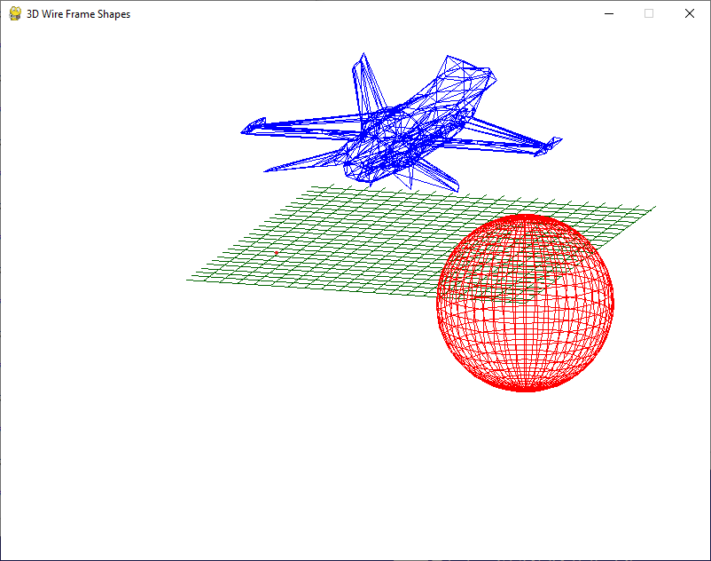

# 3dWireFrame
Simple and basic 3D Wire-Frame drawing program.
Loads .stl or .json object files.
Supports containers.
Supports line connection between objects (visual links).

## Running instructions

- Clone
- Install requirements `pip install -r requirements.txt`
- run `main.py`